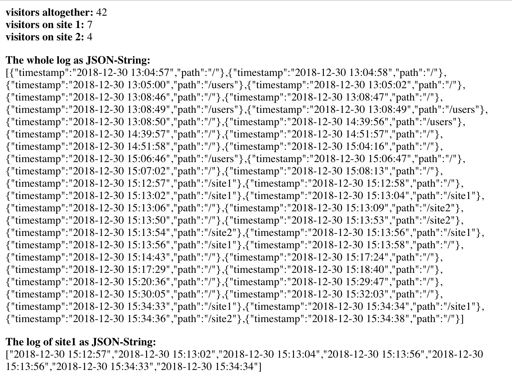

# express-visit-counter

### An express middleware that counts the visits of your website.

*app.js:*

```js
var visitCounter = require('express-visit-counter');

app.use(visitCounter.initialize());
```

## Installation

This is a [Node.js](https://nodejs.org/en/) module available through the
[npm registry](https://www.npmjs.com/).

Before installing, [download and install Node.js](https://nodejs.org/en/download/).
Node.js.

Installation is done using the
[`npm install` command](https://docs.npmjs.com/getting-started/installing-npm-packages-locally):

```bash
$ npm install express-visit-counter
```

## Example

*index.js for example:*

```js
var visitCounter = require('express-visit-counter').Loader;

router.get('/', async function (req, res, next) {
  let visitorsAltogether = await visitCounter.getCount();
  let visitorsSite1 = await visitCounter.getCount("/site1");
  let visitorsSite2 = await visitCounter.getCount("/site2");
  let visitorsLog = await visitCounter.getLog();
  res.send(visitorsAltogether + " visitors altogether<br />");
  res.send(visitorsSite1 + " visitors on site 1<br />");
  res.send(visitorsSite2 + " visitors on site 2<br />");
  res.end(JSON.stringify(visitorsLog));
});
```



## Options

```js
app.use(visitCounter.initialize({
  sqlitePath: '<path you want to store the sqlite-file>'
}));
```

## Advice

If your code contains `app.use(express.static(...));`, it often makes sence to write `app.use(visitCounter.initialize());` **after** these lines so that static js files or css files are not logged.